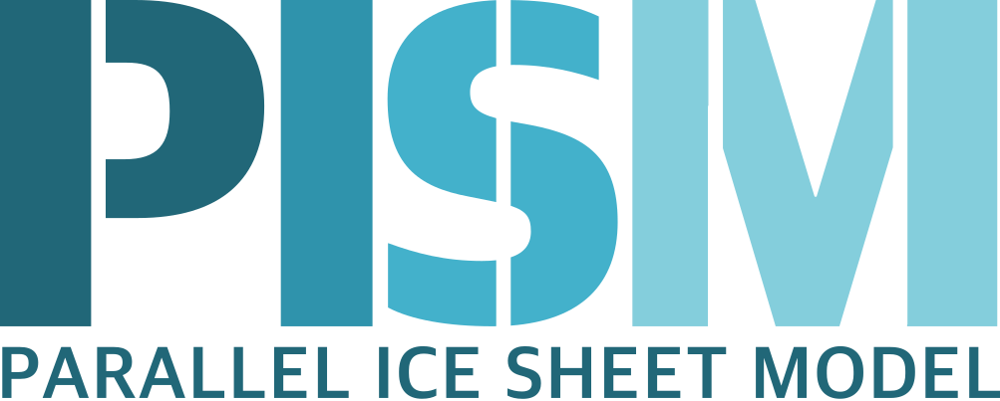
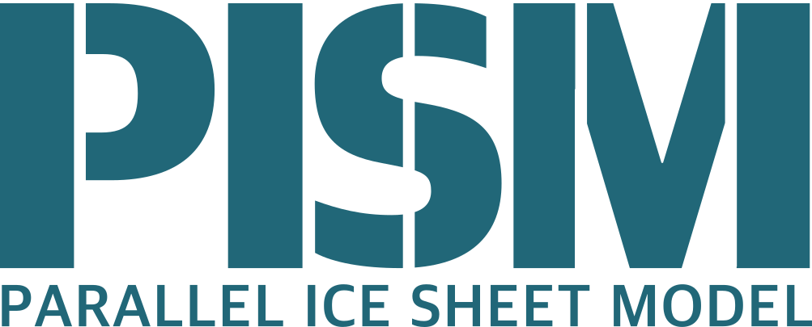
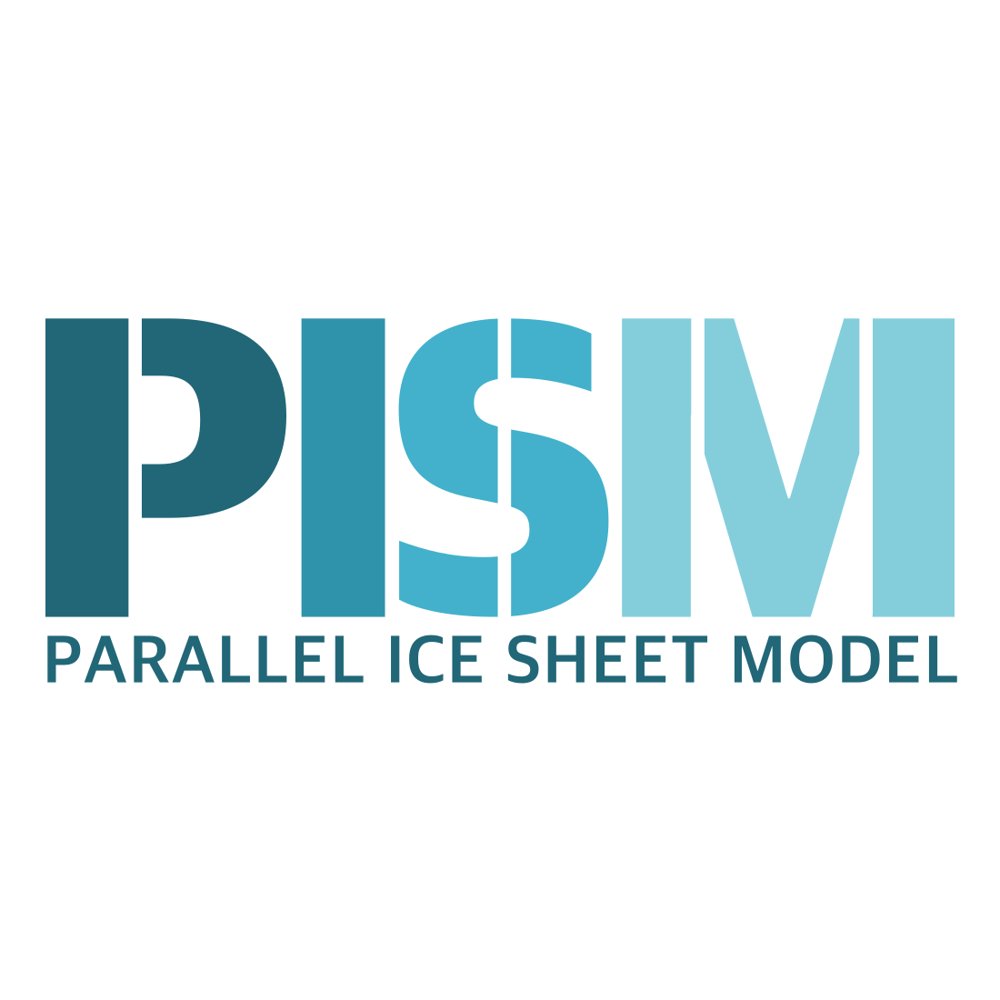
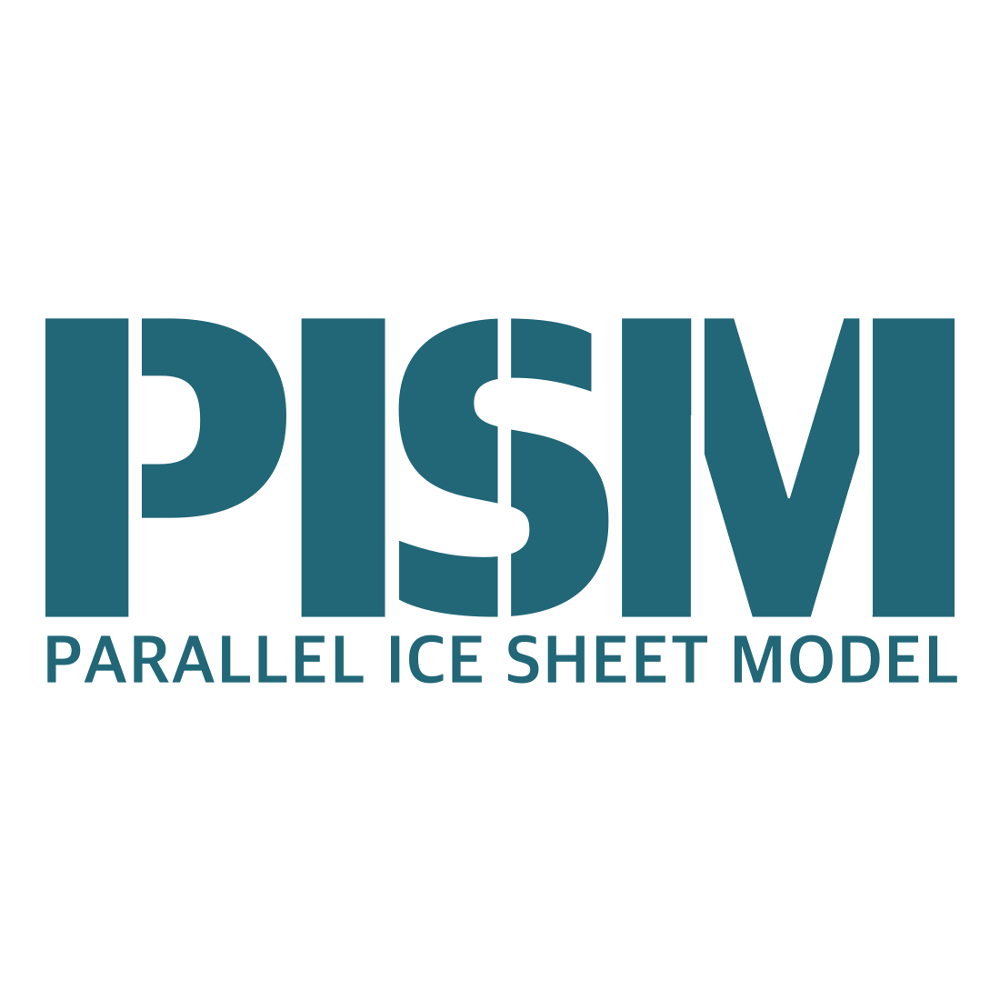

# PISM logo

This repository contains the PISM logo.

## Logo colors & font

The hex codes of the logo colors are:

-  `#216778` (theme base color)
-  `#2f93ac`
-  `#43b1cb`
-  `#84cedc`

The underlying font is `Apple SD Gothic Neo` (version 13.0d1e9), using font weights heavy and bold.

## Logo versions

### Full logo versions

| Preview | Features | File |
| :--: | ---- | ---- |
|  | <ul><li>Full color</li><li>Transparent background</li><li>Cropped to size</li></ul> | [pism_logo_transp.png](png/pism_logo_transp.png)   (PNG, 1000x400px, 96dpi) |
|  | <ul><li>Theme base color</li><li>Transparent background</li><li>Cropped to size</li></ul> | [pism_logo_transp_basecolor.png](png/pism_logo_transp_basecolor.png)   (PNG, 1000x400px, 96dpi) |

### Square versions

| Preview | Features | File |
| :--: | ---- | ---- |
|  | <ul><li>Full color</li><li>White background</li><li>Square format</li></ul> | [pism_logo_white_square.png](png/pism_logo_white_square.png)   (PNG, 1100x1100px, 96dpi) |
|  | <ul><li>Theme base color</li><li>White background</li><li>Square format</li></ul> | [pism_logo_white_square_basecolor.png](png/pism_logo_white_square_basecolor.png)   (PNG, 1100x1100px, 96dpi) |

### One-line versions

| Preview | Features | File |
| :--: | ---- | ---- |
|  | <ul><li>Full color</li><li>Transparent background</li><li>Cropped to size</li></ul> | [pism_logo_transp_oneline.png](png/pism_logo_transp_oneline.png)   (PNG, 1000x330px, 96dpi) |
|  | <ul><li>Theme base color</li><li>Transparent background</li><li>Cropped to size</li></ul> | [pism_logo_transp_oneline_basecolor.png](png/pism_logo_transp_oneline_basecolor.png)   (PNG, 1000x330px, 96dpi) |
|  | <ul><li>Monochromatic / grey </li><li>Transparent background</li><li>Cropped to size</li></ul> | [pism_logo_transp_oneline_grey.png](png/pism_logo_transp_oneline_grey.png)   (PNG, 1000x330px, 96dpi) |

### Favicon / avatar versions

| Preview | Features | File |
| :--: | ---- | ---- |
|  | <ul><li>Theme base color</li><li>Transparent background</li><li>Cropped to size</li></ul> | [pism_logo_favicon_transp_large.png](png/pism_logo_favicon_transp_large.png)   (PNG, 552x684px, 200dpi) |
|  | <ul><li>Theme base color</li><li>Transparent background</li><li>Cropped to size</li></ul> | [pism_logo_favicon_transp_small.png](png/pism_logo_favicon_transp_small.png)   (PNG, 265x328px, 96dpi) |
|  | <ul><li>Theme base color</li><li>White background</li><li>Square format</li></ul> | [pism_logo_favicon_white_square.png](png/pism_logo_favicon_white_square.png)   (PNG, 600x600px, 144dpi) |